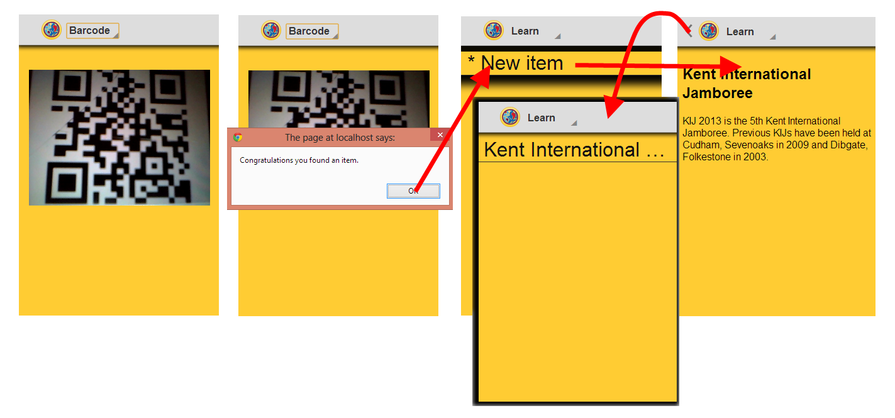

Flows
=====

This page details the flows which happen in the app, navigating from one screen
or task to another. The screenshots in this stage of design should be higher
fidelity than they currently are shown below, but this was the stage at which
they were designed.

News
----

This is the flow of viewing the news list, selecting a news item and then
viewing that item. Clicking the arrow at the top navigates back 'up' the
hierarchy.

Main Navigation
---------------

Main Navigation is handled with a spinner in the action bar at the top. Other
options not shown here include a drawer pulled in from the left for example like
that used in the Facebook app.

Events
------

Events follows a fairly standard pattern, a list with some details and actions
pulled up to the top list. Clicking on an action such as remind will perform
that action straight from the list. Clicking the item itself will navigate to
the item detail. Again clicking the 'up' arrow returns you to the list.

Barcode
-------

The flow concerning scanning and finding a barcode can be quite complicated.
There are two flows shown below. The first uses the internal barcode scanner
which is available on supported platforms and where an external native one can't
be used. Scanning a barcode in the correct format i.e.
`http://www.kij13.org.uk/learn/` takes the user to the list of items which have
already been 'found' or scanned.

The second flow is the user using his own third party barcode scanner. Some
platforms allow this behaviour - hijacking certain URLs to handle within the
specific app.

