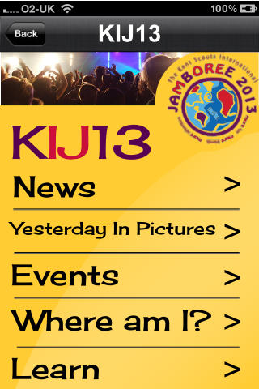
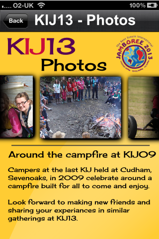
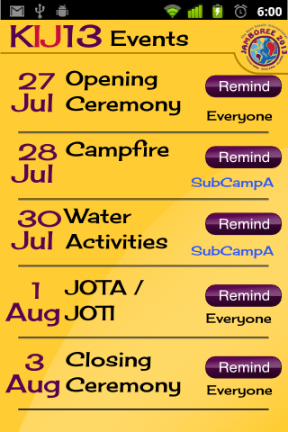
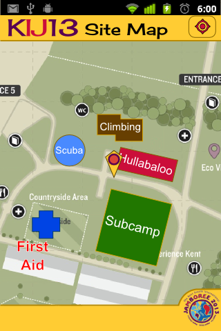
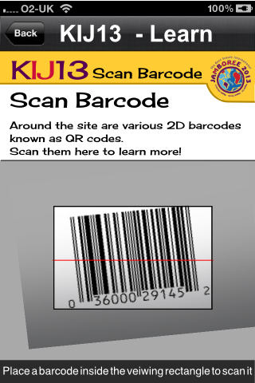
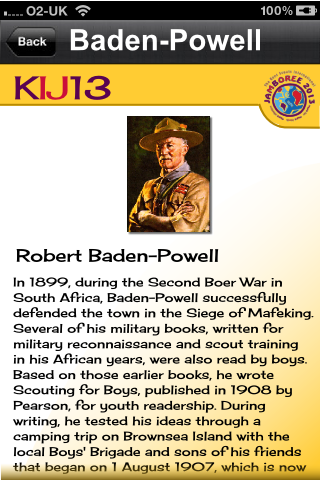

Sketches
========

Sketches are an important part of designing an app. However, in the design of
this one I skipped the sketches and went straight to colour mock-ups since I
felt the designs and layouts would essentially be fairly standard with tweaks
made later on.

Screen Mocks
------------

Here are some early conceptual screen mocks.

### Home

The early versions of the app had a 'home' screen or a landing screen which was
basically a menu page. This has been removed in preference of having a 'content
first' mentality. The app now jumps straight into displaying news content with
a navigation menu available for propper navigation. A 'home' style page may
re-emerge in a later version with summary information - latest or most important
- bubbled up to the top screen for an instant preview of available content.

### News

The first news page sketch was basically a 'list view' or equivalent listing
headlines to navigate deeper to read blog posts formatted for mobile. Later
screenshots show the news tranformed into a 'grid view' pushing images from
articles to the grid tile.

### Photos

The photos screen has been dropped in the latest version of the app but
essentially it is a photo roll from previous days loaded from the server.

### Events

Events is a key part of the app. It lets participants know of upcoming events
and can even remind the user when an event is starting so that he does not miss
it. Events can be tailored to specific sub camps.

### Map

Another important part of the app is the map. It should show the locations of
important amenities as well as activities and other notable places. Other
features would be to geolocate the user and display his position on the map and
possibly show a heading indicator to help navigate to certain features.

### Barcode

One of the key experiences around the actual site with the featuring of QR codes
on signage and other places. Participants will be able to scan these to find out
more information based on where they are standing. The barcode in the screenshot
below is actually a 1D barcode and not a QR code.

### Learn

Once a participant has found a QR code and scanned it though various mechanisms
he will end up in the app presented with additional information formatted for
their device.

